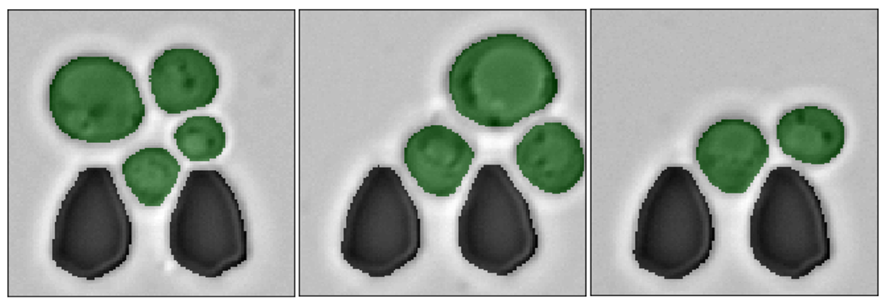
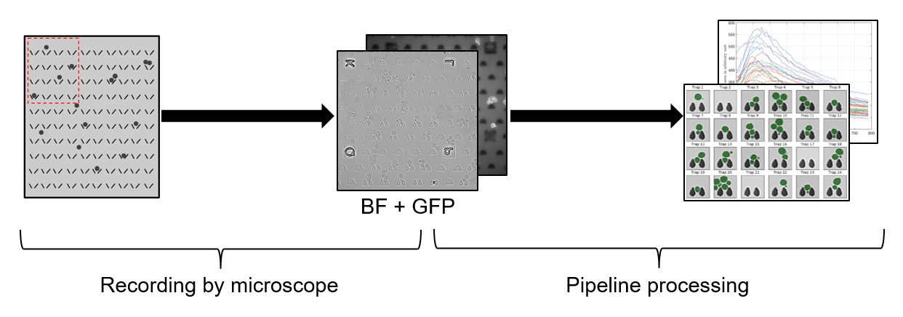

# U-Net cell segmentation with convolutional neural networks

[]()
[](https://github.com/aofrancani/UNet-Cell-Segmentation/blob/main/LICENSE)

This repository contains my *Master thesis* entitled "Analysis of the performance of U-Net neural networks for the segmentation of living cells" done in 2019 at the Technische Universität Darmstadt (TUD).




## Abstract
*The automated analysis of microscopy images is a challenge in the context of single-cell tracking and quantification. This work has as goals the study of the performance of deep learning for segmenting microscopy images and the improvement of the previously available pipeline for tracking single cells. 
Deep learning techniques, mainly convolutional neural networks, have been applied to cell segmentation problems and have shown high accuracy and fast performance. 
To perform the image segmentation, an analysis of hyperparameters was done in order to implement a convolutional neural network with U-Net architecture. 
Furthermore, different models were built in order to optimize the size of the network and the number of learnable parameters. 
The trained network is then used in the pipeline that localizes the traps in a microfluidic device, performs the image segmentation on trap images, and evaluates the fluorescence intensity and the area of single cells over time. 
The tracking of the cells during an experiment is performed by image processing algorithms, such as centroid estimation and watershed. Finally, with all improvements in the neural network to segment single cells and in the pipeline, quasi-real-time image analysis was enabled, where 6.20GB of data was processed in 4 minutes.*


## Pipeline
The brightfield and fluorescence channels of a microfluidic device are collected by an automated microscope. Then every single cell is segmented by the U-Net convolutional network. With the segmentation, the fluorescence of each individual cell is measured and tracked over time. 




## Code
The code is partially available in the U-Net folder of our official repository of the paper [**Yeast Cell Segmentation in Microstructured Environments with Deep Learning**](https://doi.org/10.1016/j.biosystems.2021.104557):

- Implementation: https://git.rwth-aachen.de/bcs/projects/tp/multiclass-yeast-seg


## Related Works and Citation
This thesis is related to two other works. **If you find this research useful in your work, please cite our papers:**

```bibtex
@article{Prangemeier2021,
    title={{Yeast Cell Segmentation in Microstructured Environments with Deep Learning}},
    author={Prangemeier, Tim and Wildner, Christian and Françani, André O. and Reich, Christoph and Koeppl, Heinz},
    journal = {Biosystems},
    volume = {1},
    pages = {1-2},
    year = {2021},
}
```
```bibtex
@INPROCEEDINGS{Prangemeier2020,
  title={Multiclass Yeast Segmentation in Microstructured Environments with Deep Learning}, 
  author={Prangemeier, Tim and Wildner, Christian and Françani, André O. and Reich, Christoph and Koeppl, Heinz},
  booktitle={2020 IEEE Conference on Computational Intelligence in Bioinformatics and Computational Biology (CIBCB)}, 
  year={2020},
  volume={},
  number={},
  pages={1-8},
}
```
